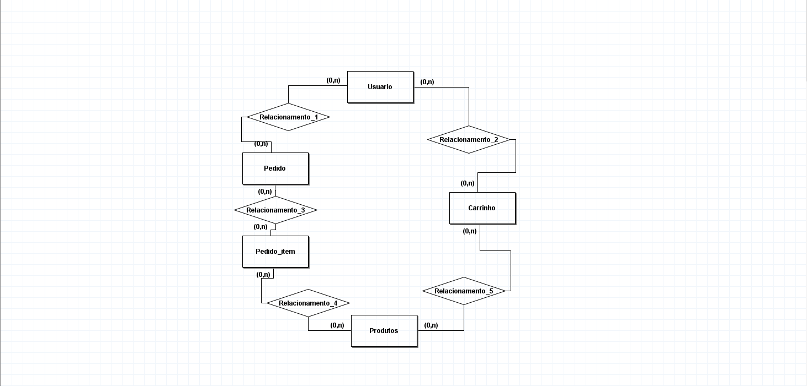
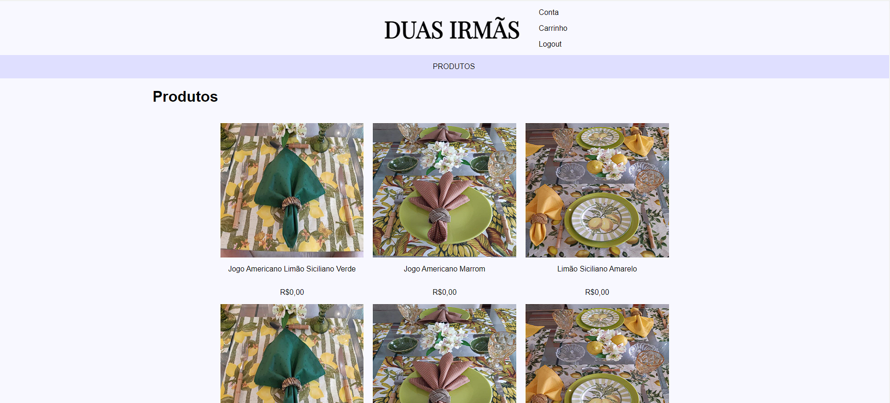
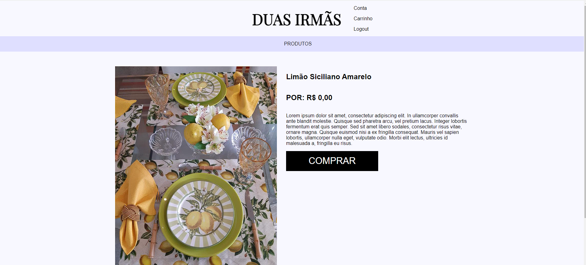
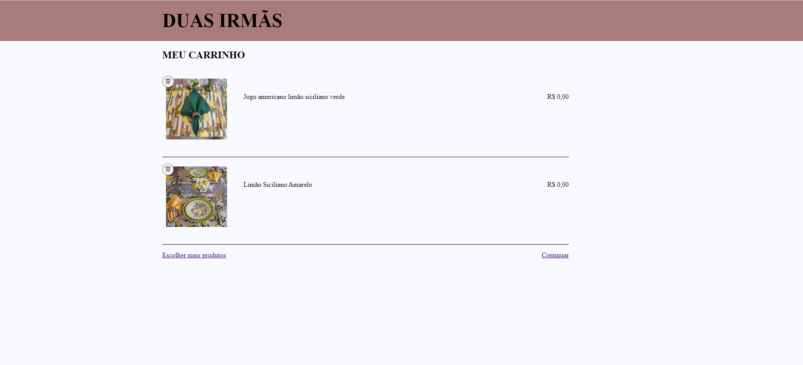
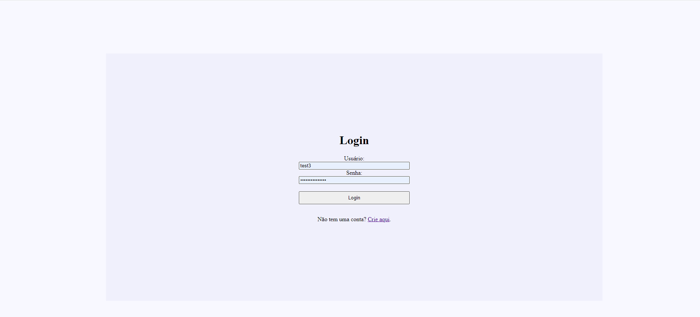

<h1 align="center">Django e-commerce App</h1>
<h2>Aplicativo web feito em django.</h2>
<h2>Funcionalidades</h2>

O usuario pode ver os produtos em catalogo,

fazer a autenticação, login, cadastro e logout,

adicionar e deletar itens ao seu carrinho,

efetuar o pedido

<h2>Banco de dados</h2>

Foi realizado a modelagem do banco de dados e a sua implementação

<h2>Galeria de imagens</h2>

<h2>Como instalar o app na sua maquina</h2>

Primeiro crie uma nova pasta e um novo ambiente virtual com o venv

instale as seguintes bibliotecas na sua maquina virtual

asgiref==3.7.1

Django==4.2.1

mysqlclient==2.1.1

Pillow==9.5.0

sqlparse==0.4.4

typing-extensions==4.6.1

tzdata==2023.3

depois execute um git clone no projeto

você deve conectar um banco de dados à aplicação e em seguida executar um makemigrations seguido de um migrate no terminal, para mais detalhes acesse a documentação oficial do django.

Depois é so executar o comando python manage.py runserver no seu terminal para iniciar a aplicação

