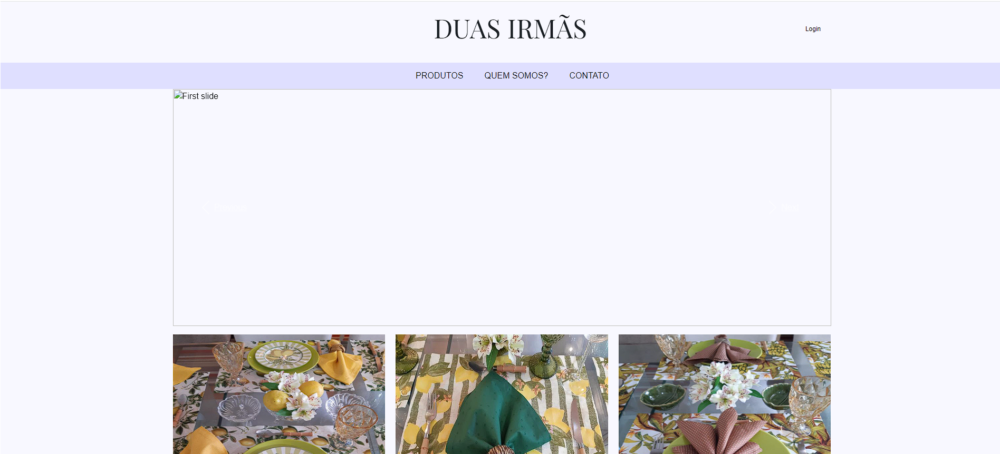
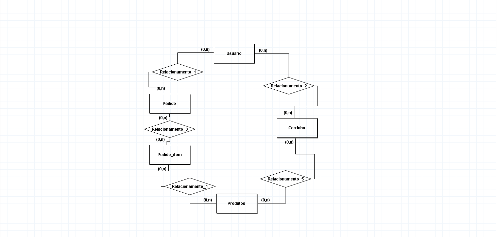

<h1>Django e-commerce App</h1>
<h2>Aplicativo web feito em django.</h2>
<h2>Funcionalidades</h2>

Usuario pode ver os produtos em catalogo

usuario pode fazer a autenticação, login, cadastro e logout

Usuario pode adicionar itens ao seu carrinho

Projeto ainda em andamento

<h2>Banco de dados</h2>

Foi realizado a modelagem do banco de dados

<h2>Como instalar o app na sua maquina</h2>

Primeiro crie uma nova pasta e um novo ambiente virtual com o venv

instale as seguintes bibliotecas na sua maquina virtual

asgiref==3.7.1

Django==4.2.1

mysqlclient==2.1.1

Pillow==9.5.0

sqlparse==0.4.4

typing-extensions==4.6.1

tzdata==2023.3

depois de um git clone no projeto e execute o comando python manage.py runserver no seu terminal para acessar o projeto!

